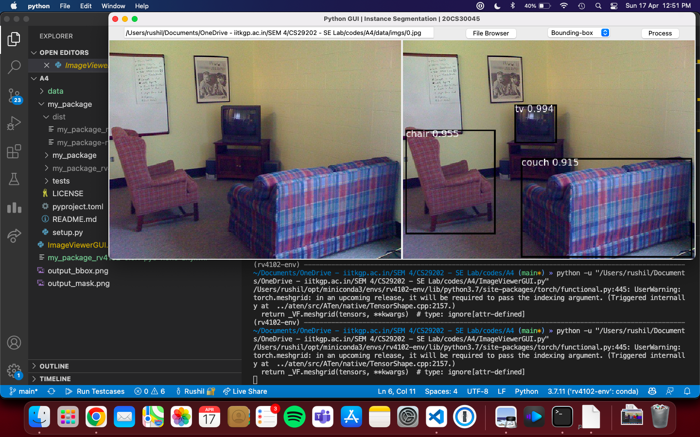
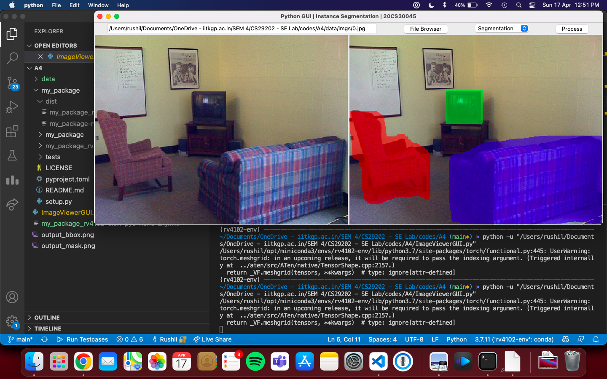

# Instance Segmentation and Detection using a Tkinter-based interface
This project is a sophisticated computer vision application that performs real-time instance segmentation and object detection using a user-friendly Tkinter interface. The project identifies and isolates individual objects within images, providing both bounding box visualization and segmentation masks.

## Key Features
- Interactive GUI built with Tkinter for easy image processing
- Detects and highlights the top 3 most confident object instances
- Dual visualization modes:
  - Bounding box detection with class labels
  - Precise segmentation masks with custom color overlays
- Supports multiple image transformations:
  - Blur
  - Flip (horizontal/vertical)
  - Rotate
  - Crop (center/random)
  - Rescale

## Technical Highlights
- Built on PyTorch's powerful deep learning framework
- Efficient image processing using NumPy and PIL
- Custom transformation pipeline for image preprocessing
- Confidence-based filtering for optimal detection results
- Clean architecture with modular design for easy extensibility
## Use Cases
- Object detection in natural scenes
- Instance segmentation for image analysis
- Educational tool for computer vision concepts
- Rapid prototyping of image processing workflows

## Dependencies
1. PyTorch
  `pip3 install torch torchvision torchaudio`
2. Numpy
  `pip3 install numpy`
3. Matplotlib
  `pip3 install matplotlib`
4. Pillow
  `pip3 install pillow`
5. mypackage-hs094
  `pip3 install ./my_package_hs094-0.0.1-py3-none-any.whl`

### Notes
1. This software determines only the top 3 entities in the given image based on a confidence score. Other detected entities are not covered by segmentation masks or bounding boxes.
2. Temporary image files (1 for bounding box and 1 for segmentation mask) are saved to disk in the working directory during the runtime of the script. It is destroyed automatically afterwards.

## Screenshots

